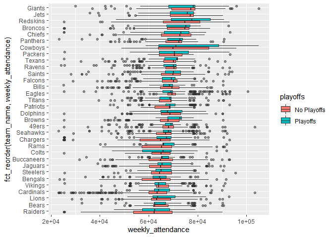
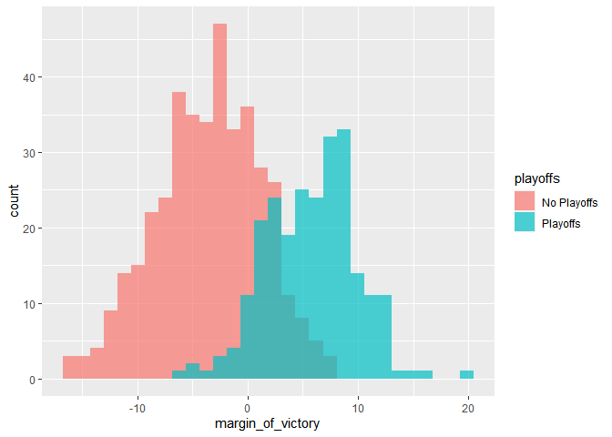
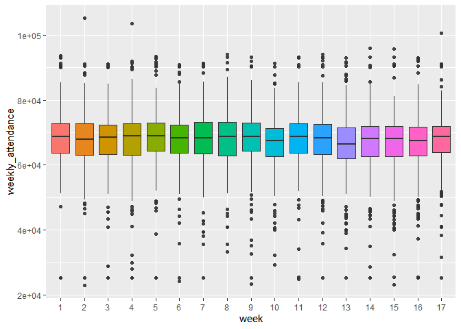
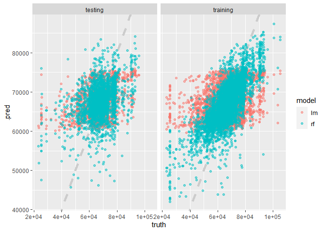
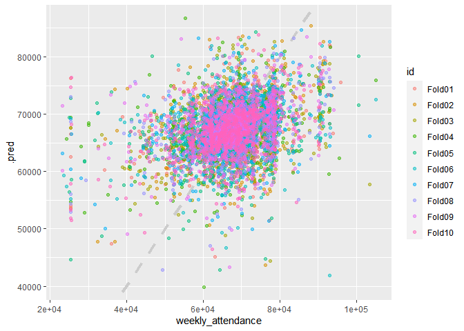

NFL\_attendance\_linear\_models
================
Alex MacCalman
`Sys.Date()`

This is about weeklty attendance to NFL
    games.

``` r
library(tidyverse)
```

    ## -- Attaching packages --------------------------------------------------------------- tidyverse 1.3.0 --

    ## v ggplot2 3.3.2     v purrr   0.3.4
    ## v tibble  3.0.3     v dplyr   1.0.1
    ## v tidyr   1.1.1     v stringr 1.4.0
    ## v readr   1.3.1     v forcats 0.5.0

    ## -- Conflicts ------------------------------------------------------------------ tidyverse_conflicts() --
    ## x dplyr::filter() masks stats::filter()
    ## x dplyr::lag()    masks stats::lag()

``` r
attendance <- read_csv("https://raw.githubusercontent.com/rfordatascience/tidytuesday/master/data/2020/2020-02-04/attendance.csv")
```

    ## Parsed with column specification:
    ## cols(
    ##   team = col_character(),
    ##   team_name = col_character(),
    ##   year = col_double(),
    ##   total = col_double(),
    ##   home = col_double(),
    ##   away = col_double(),
    ##   week = col_double(),
    ##   weekly_attendance = col_double()
    ## )

``` r
standings <- read_csv("https://raw.githubusercontent.com/rfordatascience/tidytuesday/master/data/2020/2020-02-04/standings.csv")
```

    ## Parsed with column specification:
    ## cols(
    ##   team = col_character(),
    ##   team_name = col_character(),
    ##   year = col_double(),
    ##   wins = col_double(),
    ##   loss = col_double(),
    ##   points_for = col_double(),
    ##   points_against = col_double(),
    ##   points_differential = col_double(),
    ##   margin_of_victory = col_double(),
    ##   strength_of_schedule = col_double(),
    ##   simple_rating = col_double(),
    ##   offensive_ranking = col_double(),
    ##   defensive_ranking = col_double(),
    ##   playoffs = col_character(),
    ##   sb_winner = col_character()
    ## )

``` r
#joing the datasets together
attendance_joined <- attendance %>% 
        left_join(standings, by = c("year", "team_name", "team"))
```

## Explore the data

``` r
#make a box plot of all the weekly attendance by playoffs
attendance_joined %>%
        filter(!is.na(weekly_attendance)) %>% 
        ggplot(aes(fct_reorder(team_name, weekly_attendance),
                weekly_attendance,
                fill = playoffs)) +
        geom_boxplot(outlier.alpha = 0.5) +
        coord_flip()
```

<!-- -->

``` r
# make a overlay of distributions between the playoffs and nonplayoffs
attendance_joined %>% 
        distinct(team_name, year, margin_of_victory, playoffs) %>% 
        ggplot(aes(margin_of_victory, fill = playoffs)) +
        geom_histogram(position = "identity", alpha = 0.7)
```

    ## `stat_bin()` using `bins = 30`. Pick better value with `binwidth`.

<!-- -->

``` r
# make a boxplot of the week to see if this variable influences weekly attendance.
attendance_joined %>% 
        mutate(week = factor(week)) %>% 
        ggplot(aes(week, weekly_attendance, fill = week)) +
        geom_boxplot(show.legend = FALSE, outlier.alpha = 0.7)
```

    ## Warning: Removed 638 rows containing non-finite values (stat_boxplot).

<!-- -->

## Build dataset to use for modeling

``` r
attendance_df <- attendance_joined %>% 
        filter(!is.na(weekly_attendance)) %>% 
        select(weekly_attendance, team_name, year, week,
               margin_of_victory, strength_of_schedule, playoffs)
```

## Train the model

``` r
library(tidymodels)
```

    ## -- Attaching packages -------------------------------------------------------------- tidymodels 0.1.1 --

    ## v broom     0.7.0      v recipes   0.1.13
    ## v dials     0.0.8      v rsample   0.0.7 
    ## v infer     0.5.3      v tune      0.1.1 
    ## v modeldata 0.0.2      v workflows 0.1.3 
    ## v parsnip   0.1.3      v yardstick 0.0.7

    ## -- Conflicts ----------------------------------------------------------------- tidymodels_conflicts() --
    ## x scales::discard() masks purrr::discard()
    ## x dplyr::filter()   masks stats::filter()
    ## x recipes::fixed()  masks stringr::fixed()
    ## x dplyr::lag()      masks stats::lag()
    ## x yardstick::spec() masks readr::spec()
    ## x recipes::step()   masks stats::step()

``` r
attendance_split <- attendance_df %>% 
        initial_split(strata = playoffs)

nfl_train <- training(attendance_split)
nfl_test <- testing(attendance_split)


#build a ols linear regression
# first we set the modeling engine
lm_spec <- linear_reg() %>% 
        set_engine("lm")
# here we fit a model
lm_fit <- lm_spec %>% 
        fit(weekly_attendance ~.,
            data = nfl_train)

tidy(lm_fit) %>%  arrange(-estimate)
```

    ## # A tibble: 37 x 5
    ##    term              estimate std.error statistic  p.value
    ##    <chr>                <dbl>     <dbl>     <dbl>    <dbl>
    ##  1 team_nameCowboys     6357.      764.      8.32 1.06e-16
    ##  2 team_nameRedskins    6214.      765.      8.12 5.18e-16
    ##  3 team_nameGiants      6018.      759.      7.93 2.47e-15
    ##  4 team_nameJets        4597.      774.      5.94 3.05e- 9
    ##  5 team_nameBroncos     2807.      764.      3.67 2.41e- 4
    ##  6 team_namePanthers    2123.      757.      2.80 5.07e- 3
    ##  7 team_nameChiefs      1783.      754.      2.36 1.81e- 2
    ##  8 team_nameEagles      1767.      761.      2.32 2.02e- 2
    ##  9 team_namePackers     1655.      765.      2.16 3.05e- 2
    ## 10 team_nameDolphins     783.      777.      1.01 3.14e- 1
    ## # ... with 27 more rows

``` r
# now we will train a random forest
rf_spec <- rand_forest(mode = "regression") %>% 
        set_engine("ranger")
#fit model
rf_fit <- rf_spec %>% 
        fit(weekly_attendance ~.,
            data = nfl_train)
```

## Evaluate the models

``` r
# collect the results into a tibble
results_train <- lm_fit %>% 
        predict(new_data = nfl_train) %>% 
        mutate(truth = nfl_train$weekly_attendance,
               model = "lm") %>% 
        bind_rows(rf_fit %>% 
        predict(new_data = nfl_train) %>% 
        mutate(truth = nfl_train$weekly_attendance,
               model = "rf"))

results_test <- lm_fit %>% 
        predict(new_data = nfl_test) %>% 
        mutate(truth = nfl_test$weekly_attendance,
               model = "lm") %>% 
        bind_rows(rf_fit %>% 
        predict(new_data = nfl_test) %>% 
        mutate(truth = nfl_test$weekly_attendance,
               model = "rf"))

# calculate the rmse metric for each data set
results_train %>% 
        group_by(model) %>% 
        rmse(truth = truth, estimate = .pred)
```

    ## # A tibble: 2 x 4
    ##   model .metric .estimator .estimate
    ##   <chr> <chr>   <chr>          <dbl>
    ## 1 lm    rmse    standard       8323.
    ## 2 rf    rmse    standard       6072.

``` r
results_test %>% 
        group_by(model) %>% 
        rmse(truth = truth, estimate = .pred)
```

    ## # A tibble: 2 x 4
    ##   model .metric .estimator .estimate
    ##   <chr> <chr>   <chr>          <dbl>
    ## 1 lm    rmse    standard       8308.
    ## 2 rf    rmse    standard       8645.

``` r
# visualize the predicted versus truth
results_test %>% 
        mutate(train = "testing") %>% 
        bind_rows(results_train %>% 
                          mutate(train = "training")) %>% 
        ggplot(aes(truth, .pred, color = model)) +
        geom_abline(lty = 2, color = "grey80", size = 1.5) +
        geom_point(alpha = 0.5) +
        facet_wrap(~train)
```

<!-- --> Models did not
perform well. Now we will try cross validation.

``` r
set.seed(1234)
nfl_folds <- vfold_cv(nfl_train, strata = playoffs)

rf_res <- fit_resamples(
        weekly_attendance ~ .,
        rf_spec,
        nfl_folds,
        control = control_resamples(save_pred = TRUE)
)
```

    ## Warning: `fit_resamples.formula()` is deprecated as of lifecycle 0.1.0.
    ## The first argument to `fit_resamples()` should be either a model or a workflow. In the future, you can use:
    ## fit_resamples(rf_spec, weekly_attendance ~ ., resamples = nfl_folds, 
    ##     control = control_resamples(save_pred = TRUE))
    ## This warning is displayed once every 8 hours.
    ## Call `lifecycle::last_warnings()` to see where this warning was generated.

``` r
#collect metrics
rf_res %>%
        collect_metrics()
```

    ## # A tibble: 2 x 5
    ##   .metric .estimator     mean     n  std_err
    ##   <chr>   <chr>         <dbl> <int>    <dbl>
    ## 1 rmse    standard   8631.       10 83.7    
    ## 2 rsq     standard      0.105    10  0.00554

``` r
#now let's visualize
rf_res %>% 
        unnest(.predictions) %>% 
        ggplot(aes(weekly_attendance, .pred, color = id)) +
        geom_abline(lty = 2, color = "grey80", size = 1.5) +
        geom_point(alpha = 0.5)
```

<!-- -->
