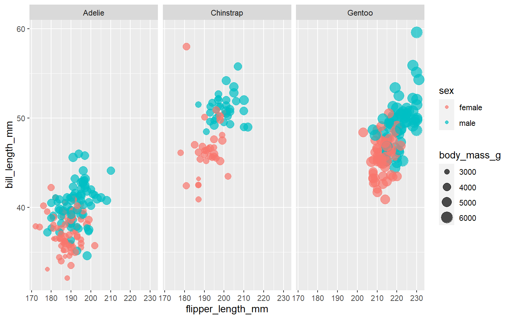
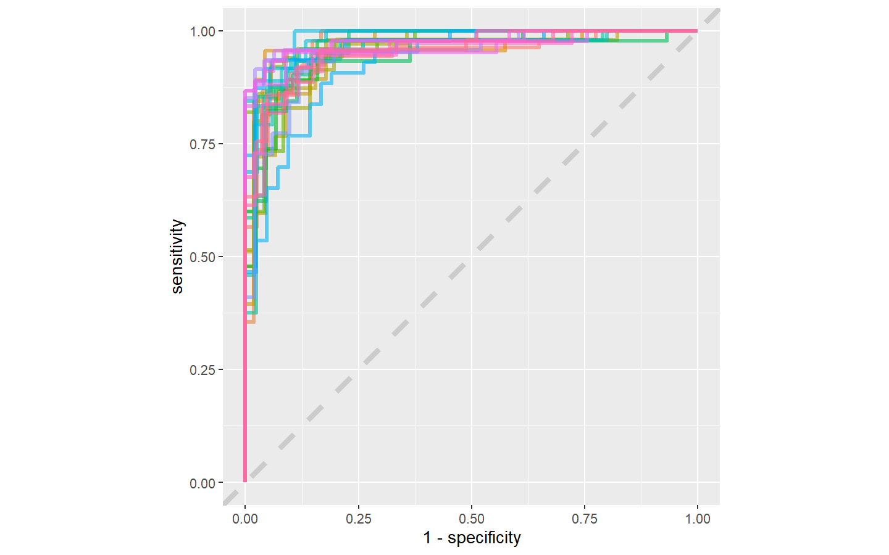
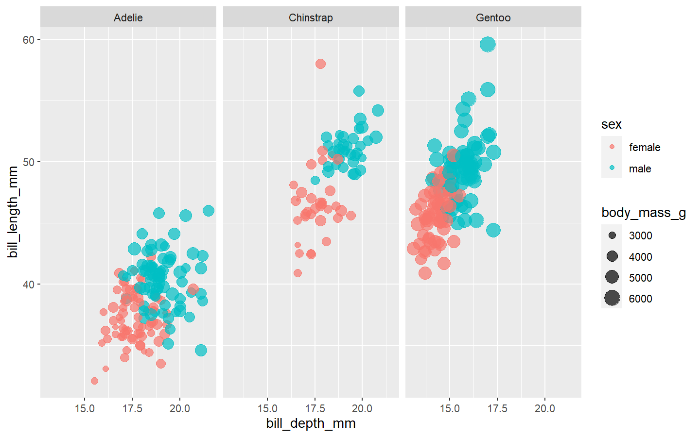

Penguins
================
Alex MacCalman
2020-08-11

## Explore the data

``` r
library(palmerpenguins)

penguins %>% 
        filter(!is.na(sex)) %>% 
        ggplot(aes(flipper_length_mm, bill_length_mm, color = sex, size = body_mass_g)) + 
        geom_point(alpha = 0.7) +
        facet_wrap(~species)
```

<!-- -->

``` r
penguins_df  <- penguins %>% 
        filter(!is.na(sex)) %>% 
        select(-year, -island)
```

## Build a model

Set up the trainingn and testing split

``` r
library(tidymodels)

set.seed(123)
penguin_split <- initial_split(penguins_df, strata = sex)
penguin_train <- training(penguin_split)
penguin_test <- testing(penguin_split)
```

Because there is very little data, we will bootstrap resamples to get
more.

``` r
set.seed(234)
#this is the data we wil use to make a model
penguin_boot <- bootstraps(penguin_train)
```

Now we will make some models. First we will set two model
specifications.

``` r
#set up the engines for the two types of models
glm_spec <- logistic_reg() %>% 
        set_engine("glm")

library(ranger)
rf_spec <- rand_forest() %>% 
        set_mode("classification") %>% # here we set the model (classification or regression)
        set_engine("ranger")
```

Now we will create a pre-processor and a model. workflow allows us to
put pieces of models together like lego blocks. This is a way to trian
models using tidymodels.

``` r
#work flow sets up a preprocessor and an model
penguin_wf <- workflow() %>% 
        add_formula(sex ~ .) #this predicts sex with all the predictors. This is the preprocessor.
#this code fits a logistic regression model
```

This part sets up the models.

``` r
#this fits a model one time  
penguin_wf %>% 
        add_model(glm_spec) %>% 
        fit(data = penguin_train) # this fits a model one time to training data
```

    ## == Workflow [trained] ====================================================================================
    ## Preprocessor: Formula
    ## Model: logistic_reg()
    ## 
    ## -- Preprocessor ------------------------------------------------------------------------------------------
    ## sex ~ .
    ## 
    ## -- Model -------------------------------------------------------------------------------------------------
    ## 
    ## Call:  stats::glm(formula = ..y ~ ., family = stats::binomial, data = data)
    ## 
    ## Coefficients:
    ##       (Intercept)   speciesChinstrap      speciesGentoo     bill_length_mm  
    ##        -79.451686          -6.614906          -9.129537           0.575980  
    ##     bill_depth_mm  flipper_length_mm        body_mass_g  
    ##          1.359093           0.070652           0.005092  
    ## 
    ## Degrees of Freedom: 249 Total (i.e. Null);  243 Residual
    ## Null Deviance:       346.6 
    ## Residual Deviance: 106   AIC: 120

``` r
#this fits a bunch of models on the bootstrap data
glm_rs <- penguin_wf %>% 
        add_model(glm_spec) %>% 
        fit_resamples(
                resamples = penguin_boot,
        control = control_resamples(save_pred = TRUE, verbose = TRUE)
        )

rf_rs <- penguin_wf %>% 
        add_model(rf_spec) %>% 
        fit_resamples(
                resamples = penguin_boot,
        control = control_resamples(save_pred = TRUE, verbose = TRUE)
        )
```

## Evaluate modeling

Now let’s evaluate the models.

``` r
#evaluate the glm
collect_metrics(glm_rs)
```

    ## # A tibble: 2 x 5
    ##   .metric  .estimator  mean     n std_err
    ##   <chr>    <chr>      <dbl> <int>   <dbl>
    ## 1 accuracy binary     0.897    25 0.00437
    ## 2 roc_auc  binary     0.961    25 0.00278

``` r
#evaluate the random forest
collect_metrics(rf_rs)
```

    ## # A tibble: 2 x 5
    ##   .metric  .estimator  mean     n std_err
    ##   <chr>    <chr>      <dbl> <int>   <dbl>
    ## 1 accuracy binary     0.892    25 0.00694
    ## 2 roc_auc  binary     0.958    25 0.00342

Both these models perform very similiarly. Beacuse teh glm is a simplier
model, we choose it.

``` r
#make a confusion matrix to evaluate the glm
glm_rs %>% 
        conf_mat_resampled()
```

    ## # A tibble: 4 x 3
    ##   Prediction Truth   Freq
    ##   <fct>      <fct>  <dbl>
    ## 1 female     female 40.8 
    ## 2 female     male    5.16
    ## 3 male       female  4.32
    ## 4 male       male   41.5

Now we will make ROC curvse ourselves.

``` r
glm_rs %>% 
        collect_predictions() %>% 
        group_by(id) %>%  #group by the id of each bootstrap, 25 curves
        roc_curve(sex, .pred_female) %>% 
        ggplot(aes(1 - specificity, sensitivity, color = id)) +
        geom_abline(lty = 2, color = "grey80", size = 1.5) +
        geom_path(show.legend = FALSE, alpha = 0.6, size = 1.2) +
        coord_equal()
```

<!-- -->

Now we are going to use our test data. The last\_fit funtion emulates
the process where, after determining the best model, the final fit on
the entire training set is needed and is then evaluated on the test set.

``` r
penguin_final <- penguin_wf %>% 
        add_model(glm_spec) %>% 
        last_fit(penguin_split) #use the original split data

penguin_final
```

    ## # Resampling results
    ## # Monte Carlo cross-validation (0.75/0.25) with 1 resamples  
    ## # A tibble: 1 x 6
    ##   splits       id           .metrics      .notes       .predictions    .workflow
    ##   <list>       <chr>        <list>        <list>       <list>          <list>   
    ## 1 <split [250~ train/test ~ <tibble [2 x~ <tibble [0 ~ <tibble [83 x ~ <workflo~

Here we look at some metrics on the final
model.

``` r
collect_metrics(penguin_final) #these collect metrics on the testing data
```

    ## # A tibble: 2 x 3
    ##   .metric  .estimator .estimate
    ##   <chr>    <chr>          <dbl>
    ## 1 accuracy binary         0.940
    ## 2 roc_auc  binary         0.991

``` r
collect_predictions(penguin_final) #this looks at the predictions
```

    ## # A tibble: 83 x 6
    ##    id               .pred_female .pred_male  .row .pred_class sex   
    ##    <chr>                   <dbl>      <dbl> <int> <fct>       <fct> 
    ##  1 train/test split    0.0117       0.988       9 male        male  
    ##  2 train/test split    0.499        0.501      12 male        female
    ##  3 train/test split    0.0000458    1.00       13 male        male  
    ##  4 train/test split    0.985        0.0155     24 female      female
    ##  5 train/test split    0.992        0.00754    26 female      female
    ##  6 train/test split    0.729        0.271      27 female      male  
    ##  7 train/test split    0.0262       0.974      32 male        male  
    ##  8 train/test split    0.415        0.585      42 male        male  
    ##  9 train/test split    0.000236     1.00       44 male        male  
    ## 10 train/test split    0.835        0.165      45 female      female
    ## # ... with 73 more rows

``` r
collect_predictions(penguin_final) %>% conf_mat(sex, .pred_class) #creates a confusion matrix of true data with predicted data
```

    ##           Truth
    ## Prediction female male
    ##     female     39    3
    ##     male        2   39

Now we will extract a fitted model workflow.

``` r
penguin_final$.workflow[[1]] %>% 
        tidy() #this tidy's the workflow so we can see the coefficient estimates
```

    ## # A tibble: 7 x 5
    ##   term               estimate std.error statistic       p.value
    ##   <chr>                 <dbl>     <dbl>     <dbl>         <dbl>
    ## 1 (Intercept)       -79.5      13.5         -5.90 0.00000000369
    ## 2 speciesChinstrap   -6.61      1.70        -3.89 0.000101     
    ## 3 speciesGentoo      -9.13      2.89        -3.16 0.00159      
    ## 4 bill_length_mm      0.576     0.137        4.20 0.0000268    
    ## 5 bill_depth_mm       1.36      0.373        3.64 0.000273     
    ## 6 flipper_length_mm   0.0707    0.0538       1.31 0.189        
    ## 7 body_mass_g         0.00509   0.00108      4.70 0.00000260

``` r
#here we tidy the coefficient estimates with exponential in order to interpret the estimates as odds ratios.
penguin_final$.workflow[[1]] %>% 
        tidy(exponentiate = TRUE) %>% #this tidy's the workflow so we can see the coefficient estimates
        arrange(estimate) # order the coeeficient estimates to see the highest impact
```

    ## # A tibble: 7 x 5
    ##   term              estimate std.error statistic       p.value
    ##   <chr>                <dbl>     <dbl>     <dbl>         <dbl>
    ## 1 (Intercept)       3.12e-35  13.5         -5.90 0.00000000369
    ## 2 speciesGentoo     1.08e- 4   2.89        -3.16 0.00159      
    ## 3 speciesChinstrap  1.34e- 3   1.70        -3.89 0.000101     
    ## 4 body_mass_g       1.01e+ 0   0.00108      4.70 0.00000260   
    ## 5 flipper_length_mm 1.07e+ 0   0.0538       1.31 0.189        
    ## 6 bill_length_mm    1.78e+ 0   0.137        4.20 0.0000268    
    ## 7 bill_depth_mm     3.89e+ 0   0.373        3.64 0.000273

bill depth has highes impact. 1 mm increase in bill depth equates to \~4
times higher odds of being male.  
For every one gram increase (body\_mass\_g) in body mass there is a 1%
increase in odds of a penguin being male (estiamtes is 1.01). 0.01 is
hwere we get 1%.

Now lets plot with the bill depth to see its impact on distinguishing
between male and female penguins.

``` r
penguins %>% 
        filter(!is.na(sex)) %>% 
        ggplot(aes(bill_depth_mm, bill_length_mm, color = sex, size = body_mass_g)) + 
        geom_point(alpha = 0.7) +
        facet_wrap(~species)
```

<!-- --> We can see
the bill depth does make the males stand out from the females.
